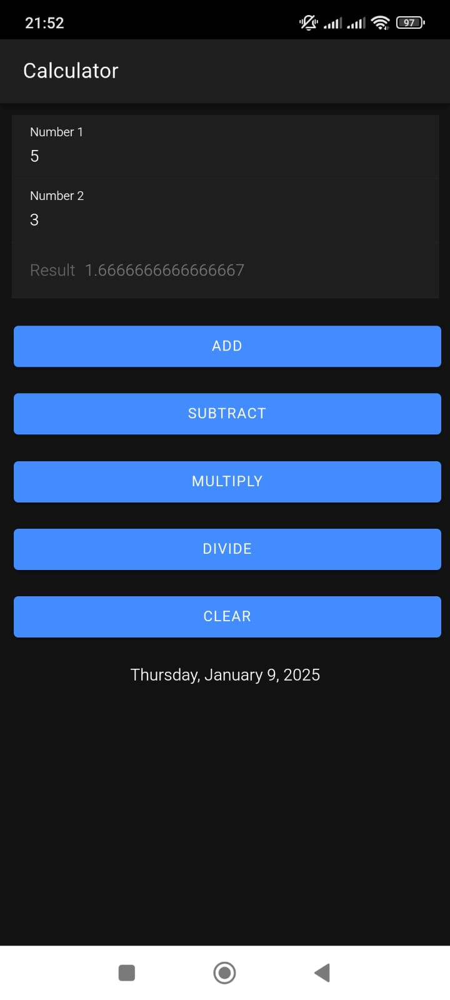

# Academic Project: Basic Calculator Example with Ionic

This project, part of our academic studies, demonstrates a **basic calculator** application developed using **Ionic**. It serves as an example of creating a cross-platform app for both web and mobile devices. 

Below is an image preview of the calculator:

